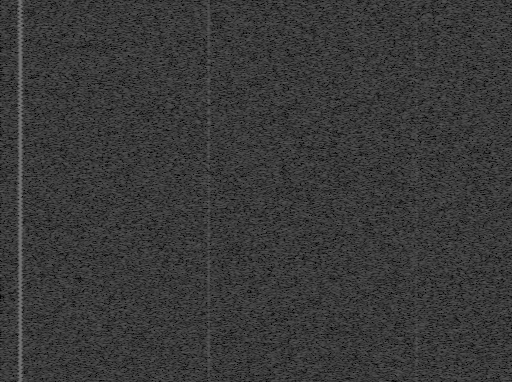
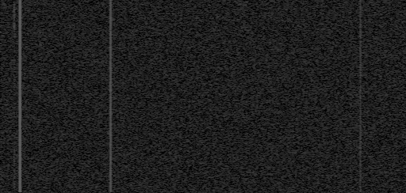
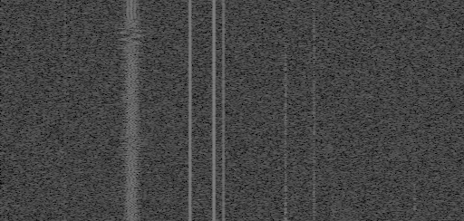
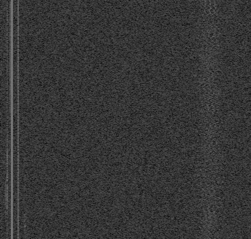
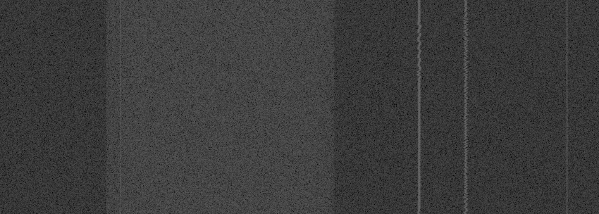

# rfspec-db
Synthetic Radio Frequency Spectrum Snapshots Database for RFML

This database contains 391 {**Y**, **W**} pairs of images, where Y is radio spectrogram containing signals and W is noise distribution.
Database was created with randomly selected:

* FFT sizes from set `{1024, 2048, 4096, 8192}`
* Time resolutions from set `{256, 512, 1024, 2048}` per second
* Sampling rates from set `{2e6, 5e6, 10e6, 15e6, 20e6, 25e6, 30e6, 35e6, 40e6}` in Hz
* Durations from set `{0.25, 0.50, 0.75, 1.00}` in seconds
* Waveforms from set `{AM, FM, CW, LSB, USB, OFDM}`
* PSNR from set `{-4, -3, -2, -1, 0, 1, 2, 3, 4, 5, 6, 7, 8, 9, 10, 11, 12}` in dB

`Note that spectrum was generated as REAL (not COMPLEX) - frequency axis resolution is fft_size/2.`

## Examples
On the left side is the radio spectrogram containing signals (**Y**), on the right side only noise distribution (**W**).

 

 

 

 

 

## Citation

```BibTex
@misc{rfspec-db,
  author = {Adam Olesiński},
  title = {Synthetic Radio Frequency Spectrum Snapshots Database for RFML},
  year = {2022},
  url = {https://github.com/aolesinski/rfspec-db}
}
```
